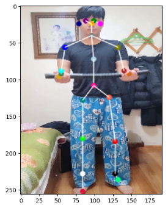
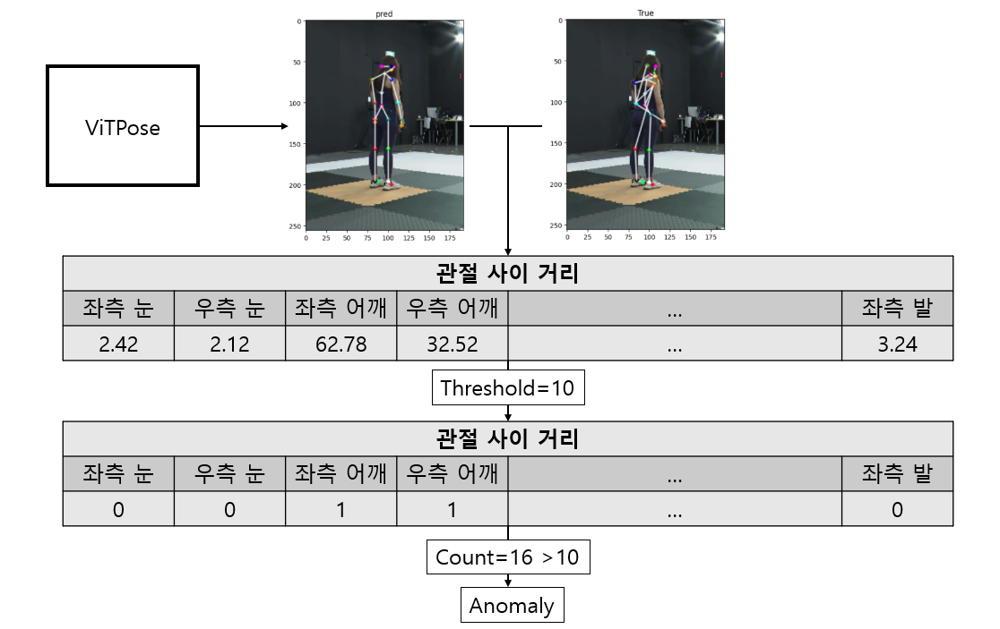
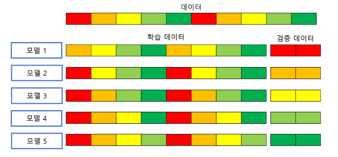
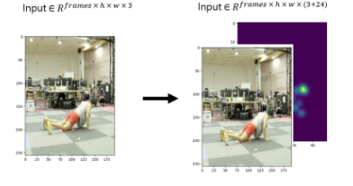
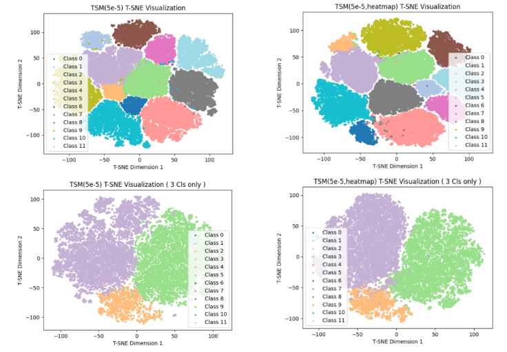

# Fitness Pose Analysis Project[실패]

## 배경

건강에 대한 관심이 커지면서 운동을 처음 시작하는 사람들은 유튜브, 페이스북 등의 영상 매체를 이용해 운동을 배우려고 하지만 실질적인 피드백을 받기가 힘들고 비용 또한 부담스러운 수준이다

## 목표

운동 영상을 통해 종류에 대해 분류하여 해당 운동 종류에 맞는 자세 피드백을 제공하는 것이 목적.

## 단계별 목표

- 파이프 라인 구축
- 자세 추정(Pose Estimation)
    - 신경망 기반 이상치 탐지 기법으로 관절 데이터 이상치 처리 가능성 확인
- 운동 종류 분류(Timeseries Classification)
    - 영상 데이터만 활용하여 ResNet-LSTM, ResNet-TSM, ResNet-3D 모델의 성능 비교
    - 모델의 Feature Vector를 활용해 T-SNE로 시각화를 통한 결과 분석 및 결론 도출
- 운동 자세 판별(Timeseries Multi label classification)
    - 제거(이유 : 신뢰불가능한 좌표 데이터)
- 모델 병합
    - 제거(이유 : 신뢰불가능한 좌표 데이터)

## 자세 추정(Pose Estimation) - 신경망 기반 이상치 제거

- 데이터의 양이 너무 많아 모두 분석하기에는 시간적으로 충분하지 않아 신경망 기반 이상치 제거

|10 Epochs|Train MPJPE|Valid MPJPE|
|---|---|---|
|이상치 존재 모델|4.55082|3.768|
|이상치 제거 모델|4.03139|3.78661|

### 과정

1. 이상치 데이터를 포함하여 모델을 학습한다.

2. 학습되지 않은 데이터(Validation Data)에 대해서 추론을 진행하여 예측값과 정답값 사이의 모든 거리를 구한다.

3. 관절 사이의 거리가 임계치를 넘기는 관절의 갯수가 파악한다.

4. 관절의 갯수가 일정 수 이상이 된다면 이상치로 판단한다.

### 학습 방법 - K-Fold Cross Validation

- 앙상블 효과로 모델의 일반화 성능 향상 가능

- 모델마다 학습한 데이터가 다르기 때문에 앙상블을 통해 기존의 문제를 보완할 수 있음

---

## 운동 종류 분류 - T-SNE 기반 분석

**결과 비교(좌: 원본, 우: 관절 히트맵 정보 제공)**

- 시각적으로 구분이 어려운 바벨 스티프 데드리프트(2,주황), 바벨 로우(3,연두), 바벨 데드리프트(5,연보라) 클래스에 대해서 경계가 명확하지 않음

- **관절 좌표에 대한 신뢰도는 낮지만 관절 좌표 정보를 제공함으로써 시각적인 정보 뿐만이 아닌 간접적으로 공간 정보를 제공하여 더 잘 구분하는 것으로 보임**

|10 Epoch|Train_ACC|Valid_ACC|
|---|---|---|
|ResNet-50-LSTM(Uni)|0.9786|0.9870|
|ResNet-50-LSTM(Bi)|0.9779|0.9856|
|ResNet-50-TSM|0.9836|0.9884|
|ResNet-101-TSM|0.9843|0.9905|
|ResNet-50-TSM-Heatmap|0.9889|0.9912|

## Directory

    /content/drive/MyDrive/fitness
    ├── dataset
    │   ├── anomaly
    │   ├── training
    │   │   ├── img
    │   │   │   ├── Day01_200921_F
    │   │   │   │   ├── 1
    │   │   │   │   │   ├── A
    │   │   │   │   │   │   ├── 002-1-1-01-Z2_A
    │   │   │   │   │   │   ├── ...
    │   │   │   │   │   │   └── 120-1-1-05-Z2_A
    │   │   │   │   │   ├── B
    │   │   │   │   │   │   ├── 002-1-1-01-Z2_B
    │   │   │   │   │   │   ├── ...
    │   │   │   │   │   │   └── 120-1-1-05-Z2_B
    │   │   │   │   │   ├── ...
    │   │   │   │   ├── ...
    │   │   │   └── ...
    │   │   ├── label
    │   │   │   ├── Day01_200921_F
    │   │   │   │   ├── D01-1-062.json
    │   │   │   │   ├── ...
    │   │   │   │   └── D01-1-120.json
    │   │   │   ├── ...
    │   │   ├── Video
    │   │   │   ├── Day01_200921_F
    │   │   │   │   ├── 1
    │   │   │   │   │   ├── A
    │   │   │   │   │   │   ├── 002-1-1-01-Z2_A
    │   │   │   │   │   │   ├── ...
    │   │   │   │   │   │   └── 120-1-1-05-Z2_A
    │   │   │   │   │   ├── B
    │   │   │   │   │   │   ├── 002-1-1-01-Z2_B
    │   │   │   │   │   │   ├── ...
    │   │   │   │   │   │   └── 120-1-1-05-Z2_B
    │   │   │   │   │   ├── ...
    │   │   │   │   ├── ...
    │   │   │   └── ...
    │   ├── validation
    │   │   ├── ...
    ├── model
    │   ├── PE # Pose Estimation 
    │   └── VC # Video Classification
    └── pretrain
        └── pose # Pose Estimation 
